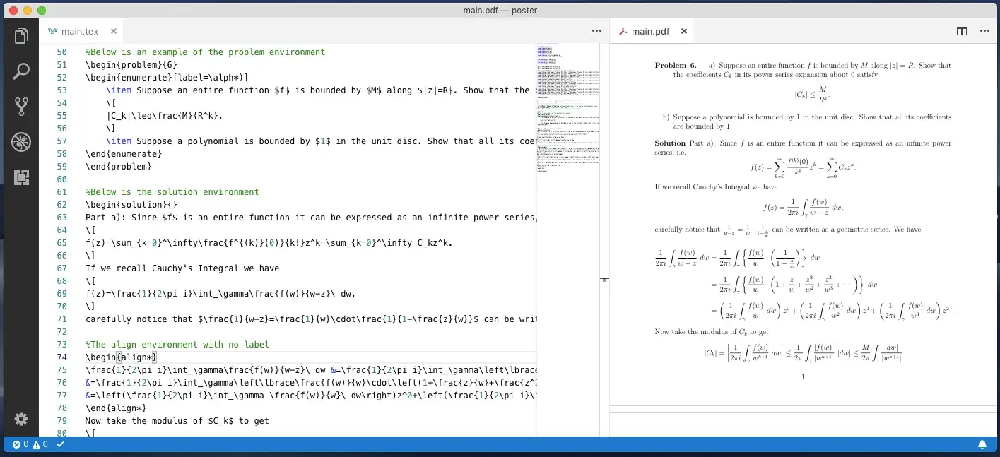
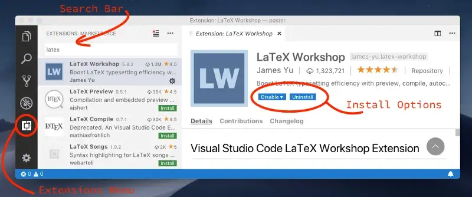
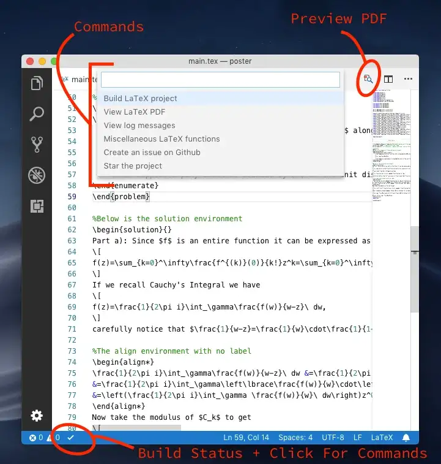
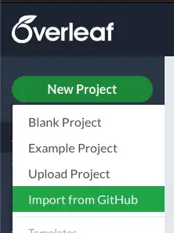
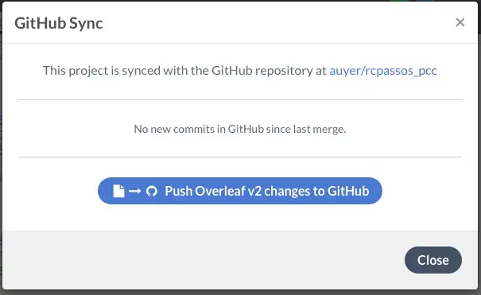

> _If you want to write LaTeX on your machine, VS Code is a great option for you! Installing all the necessary packages is a simple process. And with the power of Git, you can sync with web-based editors like Overleaf, and have satisfying versioning and backup._


LaTeX Workshop on VS Code

## Why LaTeX

For the uninitiated, LaTeX is not an editor, but a typesetting system. There are a few very compelling reasons why someone might want to use LaTeX instead of the conventional text systems. For me, these are the three most important:

- Focus on Content first, and let LaTeX deal all the formatting

First, the clear separation between formatting and content allows you to focus on developing your content. That means you wont need to re-format the whole document at each iteration.

Image (and table) numbering and the summary is also a big deal with LaTeX. You will not manually add numbers to any of them, you will define labels and reference those in your source. When compiling, LaTeX will worry about the order and numbering.

On top of all of that, there are a ton of LaTeX templates out there, and they make your job a lot easier. It is also not that hard to customize them when you get used to it.

- Easy Citations

Never worry about the citation style again. Once you chose the right one for your document, all you need to do is put the bibtex citations (that most sites give you, including Google Scholar) in your bib file, and reference them in your text.

- High-quality typography

If you are writing any technical document, you might need some formulas or special symbols. The quality of those in LaTeX is unmatched in any other editor. All letters and symbols will look as crisp as they can be.

Convinced yet? If not, you might what to google about it, or read this articles:

- [Why I write with LaTeX (and why you should too)](https://medium.com/@marko_kovic/why-i-write-with-latex-and-why-you-should-too-ba6a764fadf9) by Marko Kovic
- [What the heck is Latex?](http://scottmcpeak.com/latex/whatislatex.html) by Scott McPea

---

## Installing tools

The installation process can be a little bit different for each system, but the process should be very straightforward. In some systems, you will have multiple options to download. I recommend taking the most complete packages ( without GUI ). They are less likely to give you a headache trying to install additional libraries later.

Some common Linux commands for installing LaTeX are:

```bash
# Arch Linux Family
sudo pacman -S texlive

# For Ubuntu, you might need a ppa:
sudo add-apt-repository ppa:jonathonf/texlive
sudo apt update && sudo apt install texlive-full

# Fedora
sudo dnf install texlive-scheme-full
```

In MacOS, I chose to install MacTeX without any GUI application, afterall, I am going to use VS Code for that. But if you desire to keep the GUI apps, just remove the “no-gui” from the name. If you dont have homebrew ( brew command), install it. It is a very handy tool for installing Terminal tools and even a few community apps.

After the installation is complete, it is necessary to update the LaTeX packages with the tlmgr command line tool that already comes with MacTeX.

```bash
# macOS MacTex Install
brew --cask install mactex-no-gui

# Updating the packages
sudo tlmgr update --self && sudo tlmgr update --all
```

Now, let us install LaTeX Workshop plugin from the Visual Studio Code Marketplace.


Extensions Page in VS Code

Or install it by running the following command in the command palette:

```bash
ext install latex-workshop
```

At this point, if you open a TeX file, you should be able to see it working, and your screen will be comparable to the one in the image below.
When clicking the preview option, you will have a choice to see the document in another tab of VS Code, or in a different app. If you opt for the tab, you are going to get a layout similar to the one in the first picture of this article.


Latex Plugin Main Options

By default, your document will be recompiled automatically on save. With this, the whole process of delivering the PDF becomes an automated process. All you need to do is pick the file from your folder, and its ready to go.

---

## LaTeX + GIT

If you are a developer, you might be used to versioning everything (hopefully). So why not use GIT in your LaTeX documents as well?

If you are only editing it locally, it is just as simple as creating any other repository. But this starts shining when you want to work with others, or you want people to be able to check your work without you heaving to send it to them every time. On top of that, uploading your content to a remote GIT repository can protect you in case of a catastrophic failure in your personal machine.

```bash
git init
git add your_files_here
git commit -m "The commit message"
git remote add origin https://github.com/username/repo
git push -u origin master
```

It is recommended to use a .gitignore file to keep your repository free of temporary files, and any side products created during compilation.

I recommend using the pre-built one from the [github.com/github/gitignore](http://github.com/github/gitignore) repository.

---

## Integrating with Overleaf

Overleaf and ShareLaTeX are two of the most popular LaTeX web editors out there. The two platforms are joining forces into the “Overleaf V2”. Overleaf had an interesting GIT feature in version 1, that has evolved into a GitHub sync feature in version 2. It is not clear if this is going to be a free feature or not. It is a premium feature for ShareLaTeX, but free for Overleaf v1 users.

When creating a new project, there is an option to import it from GitHub:


Overleaf v2 New Project Page

If you cant see this option, you might need to activate it somewhere.

This feature works with private repositories as well. And all you need to do is authorize Overleaf by logging into your GitHub account.

Now, when you open the Menu, there is an option to Sync with GitHub. The panel shown in the picture below is where you can PULL and PUSH changes to your Git repository. This way you can keep your collaborators up to date with what you’ve created offline, and you can work from a different computer when you need/desire. Neat!


GitHub Sync Panel

## Conclusion

If you are comfortable with VS Code, it might just be your best bet at writing LaTeX on your machine. The possibility of synchronizing your local repository with a web-based collaboration tool allows you to keep writing without internet in your local copy, or without your computer in the web editor.

I hope this article was useful for you. Might any question pop up, do not hesitate in posting a comment! Thanks!
